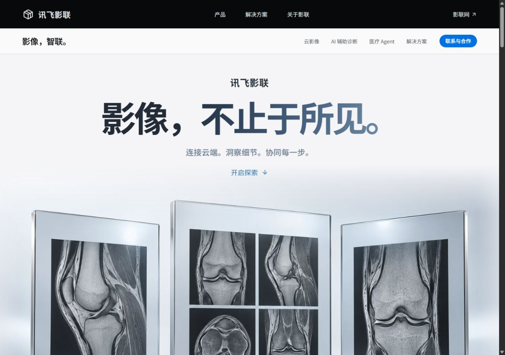
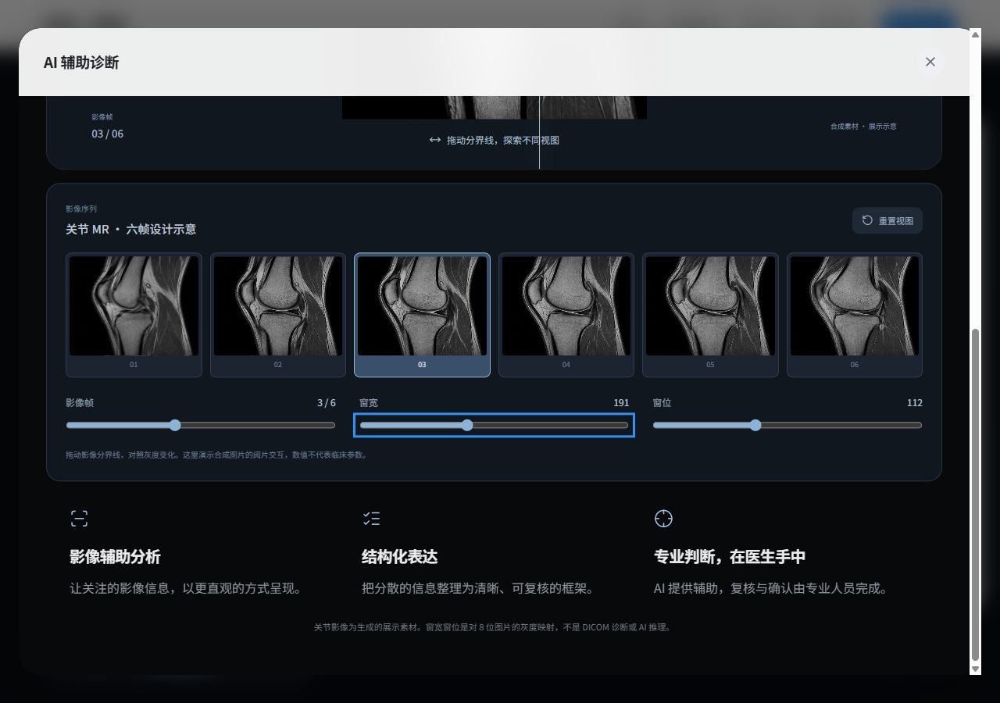
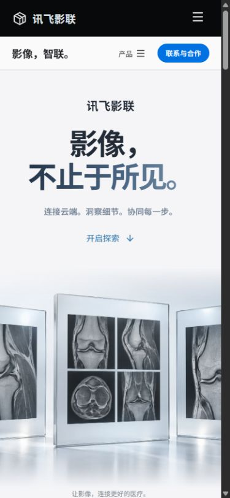

# 验证记录

日期：2026-10-09。对象：讯飞影联品牌官网设计概念，关节影像视觉版本。

## 自动检查

- `npm test`：7 个流程生命周期测试通过，覆盖四步推进、停止、场景取消、重启、过期事件和非法场景。
- `npm run build`：TypeScript 严格检查及 Vite 生产构建通过。
- 首页 JS 389.41 KB / gzip 125.21 KB；云影像、医疗 Agent、阅片展台 JS 分别为 3.83 / 5.06 / 5.14 KB；CSS 45.25 KB / gzip 10.44 KB。
- 发布图片三张，共 604,456 字节。图集只需一次图片请求，六帧通过背景定位或 Canvas 裁切呈现。
- 旧脑部/头部素材仍在 docs/reference-assets，不进入 dist/media；旧 WorkspaceArtwork 组件已删除。
- `git diff --check` 通过。
- 新入口没有日志读取、Token 后端、患者数据或诊断模型调用。

## 实际浏览器检查

使用 Codex 浏览器检查开发版与本地生产预览版。

- 1280 × 900：首屏图片加载，天然尺寸 1672 × 941，文档宽度不超过视口；生产版截图已保存。
- 390 × 844：首屏影像裁切、局部阅片章节、弹窗与六帧控制正常；文档和弹窗无横向溢出。
- 1920 × 1080：文档宽度不超过视口；局部说明标签的左右边界位于视口内。
- AI 章节始终只有一个标题节点；原先出屏的局部说明改为影像内深色标签。
- 开发版对照线 ArrowRight 从 55 更新至 56；窗宽从 190 更新至 191；窗位 End 更新至 192。实际画面中灰度调整侧明显变暗，原始侧保持对照。
- 点击第六帧按钮与手机帧滑块 End 均选中第六帧。重置恢复帧索引 2、窗宽 190、窗位 112、分界线 55。
- 生产版阅片展台 Canvas 正常挂载，窗宽键盘操作更新为 191；读取的生产页 error 日志为空。
- Escape 关闭展台，焦点恢复到原入口按钮。
- 云影像生产展台显示合成影像；切换院内云 PACS 后，标题与场景说明更新。
- `?motion=off` 实际渲染三个静态 article，无 sticky 场景；手机上的两块静态影像板均为 325 × 400，未塌陷。

Agent 生命周期和联系弹窗沿用既有实现；本次未改动其状态逻辑，使用已有流程测试验证取消与过期事件。

截图：

合成影像及 8 位灰度映射仅用于前端设计展示，不是实际检查序列、DICOM 诊断或 AI 推理。未做真实临床分析、后端咨询提交或实际平台登录。

旧版截图仍保留在 docs/images 中作为项目历史材料；旧图不会进入 dist。
