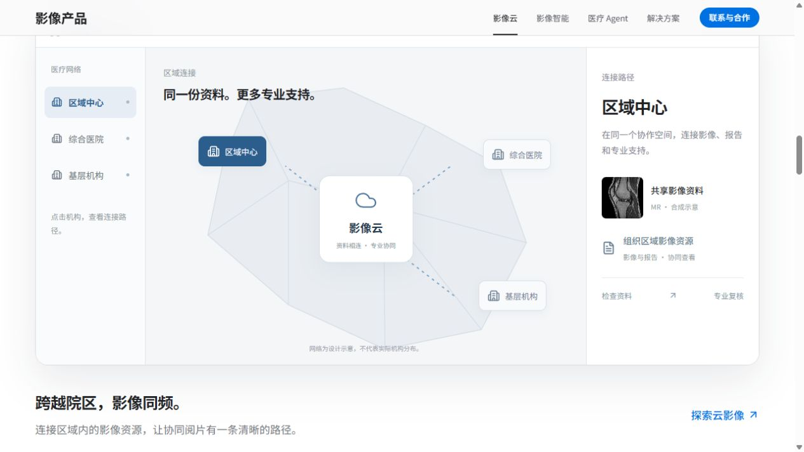
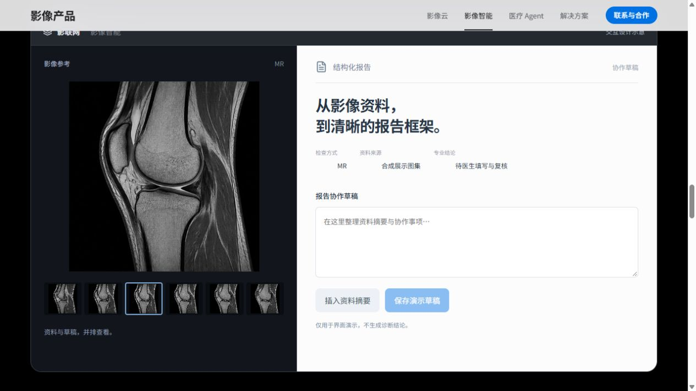
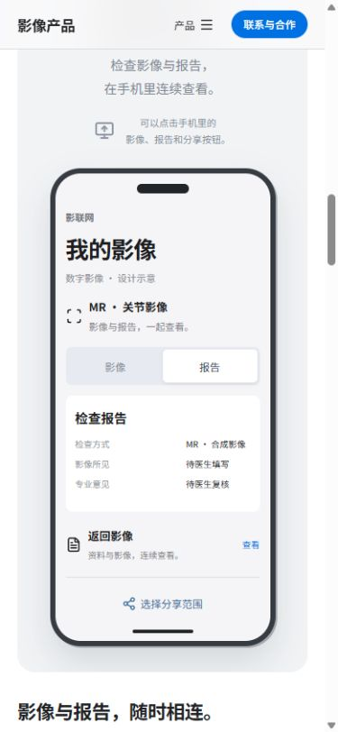

# 验证记录

日期：2026-10-09。对象：六种独立产品场景与整幅亮点图片。

## 自动检查

- npm test：7 个协作流程生命周期测试通过。
- npm run build：TypeScript 严格检查与 Vite 生产构建通过。
- 首页入口 JS 264.04 KB / gzip 81.82 KB，共用 UI 分包 140.57 KB / gzip 47.73 KB。
- CSS 53.94 KB / gzip 11.92 KB；移除旧 reader、insight、cloud-desktop 与稀疏网络亮点样式。
- 未新增依赖或图片。三个 WebP 素材复用；六帧影像共享一个图集。

## 浏览器检查

使用本地生产预览 4173 与开发页面进行实际点击。桌面 1280 × 720，手机 390 × 844。

- 六个选项分别显示区域连接、手机影像、远程会诊、六帧质控、报告编辑、双视图对照；手机六种场景均无文档横向溢出。
- 区域网络节点选择与机构侧栏、连接说明保持同步。
- 手机影像可切换到报告；分享范围取消勾选报告后，确认显示仅选择影像；不进行真实传输。
- 会诊可暂停与恢复影像展示；会诊纪要为受控输入，保存后显示本页保留状态；不申请麦克风或视频权限。
- 质控选择第 3 帧后可以标记与撤销复核；状态与帧标记一致。
- 报告可插入非诊断资料摘要、修改、保存；切换其他功能后草稿保留。
- 联动翻帧将两侧同时推进至第 3 / 第 6 帧，继续向前按钮禁用；独立模式只改变所选一侧。
- 放大显示 125%，复位恢复初始帧、100% 与联动状态；手机也能完成翻帧和缩放。
- 云影像与 AI 详情均可使用新的场景；首页与详情同时挂载时没有重复 HTML id。
- Escape 关闭详情，焦点恢复到入口；Tab 的 Home 键回到第一项。
- 亮点初始 scrollLeft 为 0，首张左边距约 58px，图像加载成功；标题只有一处。
- 亮点按钮到第四项后禁用下一项，返回第一项后禁用上一项；滚动位置计算使用实际卡片偏移，不硬编码卡片宽度。
- 键盘右方向键将亮点推进到数字影像；生产预览来源的 error 日志为空。
- ?motion=off 下场景 animationName 为 none；没有固定扫描轨道。

上述交互是浏览器内的产品设计演示，不验证临床性能、实际会诊、AI 推理或平台账户能力。本页状态在刷新后清除，详情状态在关闭后清除。

## 本次截图

历史图片保留在 docs/images，不进入部署输出。
