# 验证记录

## 当前连续转场与查看器版本

日期：2026-10-10。对象：卡片展开返回、交互影像查看器、本机性能测量及回归检查。

- Node.js 22.16.0；8 个测试文件、30 项测试通过；TypeScript 严格检查、生产构建及资源预算通过。没有新增依赖。
- 卡片和详情共享产品、标题与封面的 layoutId；Portal 内退出完成后恢复入口焦点与页面滚动。快速 Escape 后重开数字影像入口正常，减少动画模式也可完整操作。
- 查看器支持 100%—400% 缩放、鼠标位置锚定、受限拖拽、双指缩放与键盘平移。缩放和平移使用 RAF 合并；画布采用相对坐标，尺寸改变后标注仍对应相同影像位置。
- 框选按帧存放，翻到另一帧隐藏，返回原帧恢复；撤销、重做和清除使用命令历史，撤销后编辑会清除重做分支，历史保留最多 50 个快照。
- 单元及 React DOM 测试验证缩放锚点、双指中心移动、范围限制、尺寸变化、历史分支与边界、触点切换取消框选、pointercancel、RAF 合并及卸载清理。
- 最终生产预览实际 CSS 1440 × 1000 和 390 × 844 各运行 14 项浏览器断言，全通过。手机结合减少动画模式检查；桌面与手机文档及详情均无横向溢出，控制台 error 日志为空。原始结果见 browser-desktop.json、browser-mobile.json。
- 实际滚轮将 100% 放到 182%，视图产生对应锚点偏移；实际框选和撤销重做已验证。导出文件 DEMO-00001-annotations.json 已下载并读取，schema、合成资料标记、资料编号、帧号与归一化坐标均正确。
- 开发诊断采集到 13 条真实 React 提交，包含查看器的 mount 和 update；标准生产构建明确不启用 React profiling。浏览器指标与样本保留在 JSON 记录中，不当作完整 Web Vitals 或跨设备性能结论。
- 最终资源预算由 Node zlib 对构建文件检查：入口 JS、浏览器模块 JS、入口 CSS、六份 WebP 都在阈值内。摄影与图集没有新增或替换。
- 浏览器脚本通过 Codex 会话运行，CI 执行单元测试、构建和体积预算；未宣称 CI E2E、像素截图差异回归、多浏览器或实体多点触屏均已验证。详见 BROWSER_TESTING.md。

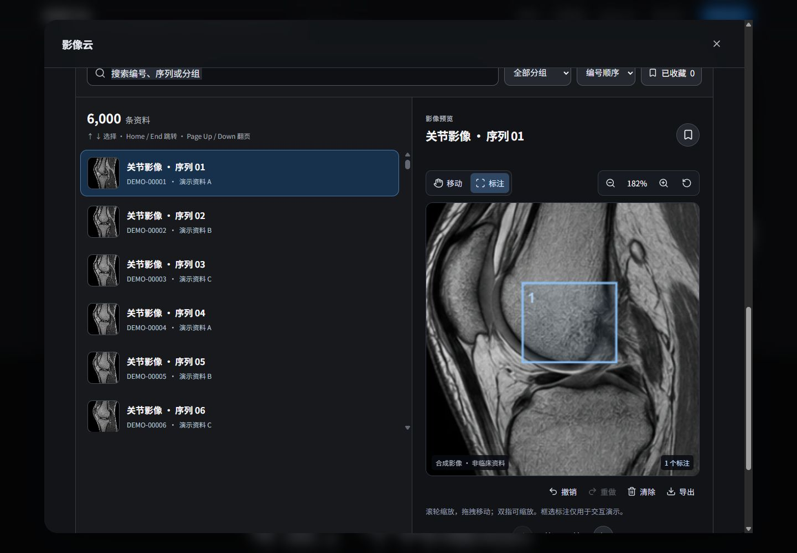

## 当前渲染进阶版本

日期：2026-10-10。对象：减少重复渲染、资料长列表、详情异常隔离。

- Node.js 22.16.0；npm test：6 个文件、21 项测试通过；TypeScript 严格检查与生产构建通过。
- 新增 TanStack React Virtual 3.14.14；jsdom 27.4.0 仅用于组件测试，兼容本地 Node。首页没有新增业务切换或工具面板。
- 最终入口 JS 359.61 KB / gzip 113.96 KB，共用内容模块 17.66 KB / gzip 7.60 KB。资料浏览独立模块 34.39 KB / gzip 10.88 KB，独立 CSS 5.18 KB / gzip 1.56 KB；只有打开资料浏览时才导入。
- 生产预览按实际 CSS 视口 1440 × 1000、390 × 844 检查。桌面文档宽等于视口，弹窗 scrollWidth 等于 clientWidth；手机同样无横向溢出，列表和预览上下排列。
- 6,000 条资料初始仅挂载 11 行；End 直接选中 DEMO-06000，滚动偏移 527,490px，预览与 aria-activedescendant 指向同一资料，仍只挂载 11 行。
- Page Down 从第 1 条推进至第 6 条；Home、End、方向键共享受限选择与 scrollToIndex。
- 精确搜索 demo-06000 返回 1 条，滚动复位为 0，预览显示该条资料；分组 B 加时间倒序返回 2,000 条，第一条为 DEMO-05999。
- 收藏第 6,000 条不改变列表偏移或预览当前第 5 帧；只看收藏返回 1 条。取消最后一项后显示空状态，焦点留在列表；显示全部资料后焦点回到搜索输入。
- 单元测试用实际 React 渲染验证：无关父级更新不重新渲染资料缩略图；选择变化更新 aria-selected；翻帧边界、收藏后保留帧、换资料重置均正确。
- 真实抛出渲染异常和拒绝 lazy Promise 的测试均进入错误边界。局部重试重新挂载已恢复组件；错误字符串不出现在产品界面。
- 额外弹窗测试验证：异常移除焦点元素后，Tab 与 Shift+Tab 仍进入弹窗控件；Escape 关闭并恢复入口焦点、解除页面滚动锁定。此故障路径通过 jsdom 测试验证，没有在生产 UI 增加故障按钮。
- 浏览器实际检查 Escape 关闭资料详情后焦点回到入口；AI 报告编辑保存、Agent 启动和复位、章节链接均正常。生产预览 error 日志为空。
- 这些条目是生成的资料索引，共用已有六帧合成图集；不是医院数据或 6,000 份独立影像。收藏与筛选在收起资料浏览、关闭详情或刷新后清除。
- 错误边界处理子树渲染及 lazy 加载失败，不捕获普通事件回调或计时器错误；失败的 lazy 模块可能需要页面重载，局部重试不承诺重新请求已拒绝的模块。

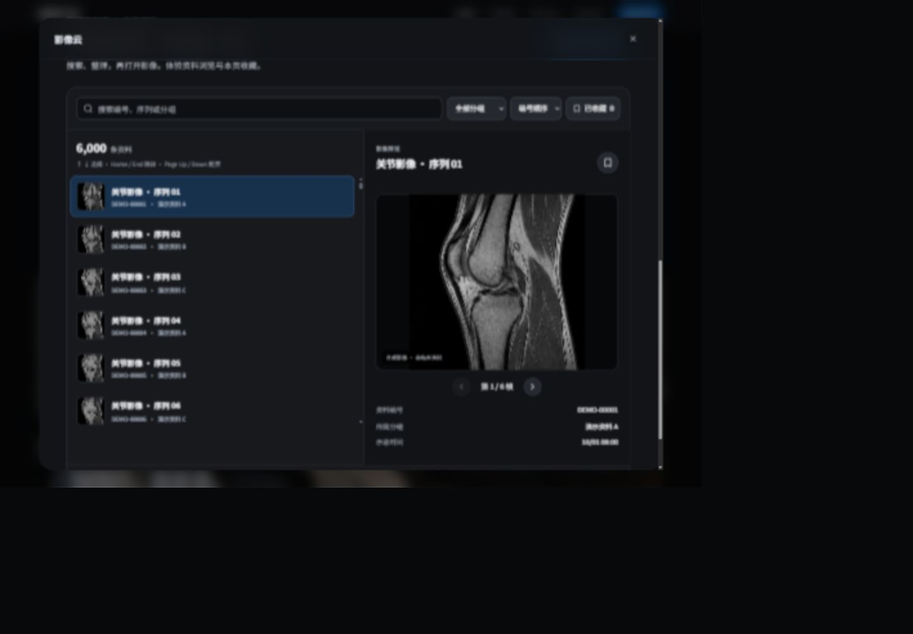

## 前版产品宣传记录

日期：2026-10-10。对象：移除首页业务 Tab、重做摄影素材与章节、清理旧代码。

- npm test：7 项生命周期测试通过；TypeScript 严格检查及生产构建通过。
- 最终入口 JS 375.57 KB / gzip 119.68 KB；CSS 48.34 KB / gzip 10.10 KB。详情继续按需加载，没有新增依赖。
- 生产预览在 1440 × 1000、1920 × 1080、390 × 844 下无文档横向溢出。
- 首页 Tab 数为 0；云影像、AI 与三类医疗方案的说明直接呈现。
- 1440 × 1000 首屏主图底部为 983.61px，完整可见；桌面三张亮点宽约 411px，原图宽 1122px。
- 首屏和亮点五张 img 均加载成功，五个唯一素材地址，每张照片只出现一次。
- 手机图库初始 scrollLeft 0，首张距左边 20px；两次下一项进入 3 / 3，并禁用下一项；键盘左方向键返回数字影像。
- AI 详情报告输入和保存成功；Escape 关闭后焦点回到入口，没有重复 HTML id。
- 手机 AI 详情可切换多期对比，弹窗无横向溢出。
- 页脚医共体跳转到 #solution-1，目标距视口顶部约 90px；合作按钮打开正确联系弹窗。
- 1920 × 1080 三类方案同时可见，方案内没有 Tab。
- 生产预览 error 日志为空。
- 六份 WebP 共 1,485,430 字节；首屏高优先级加载，其余摄影延迟加载。
- 已移除 HighlightArt、两份旧样式和旧首屏交互，以及无用途的方案选择状态。

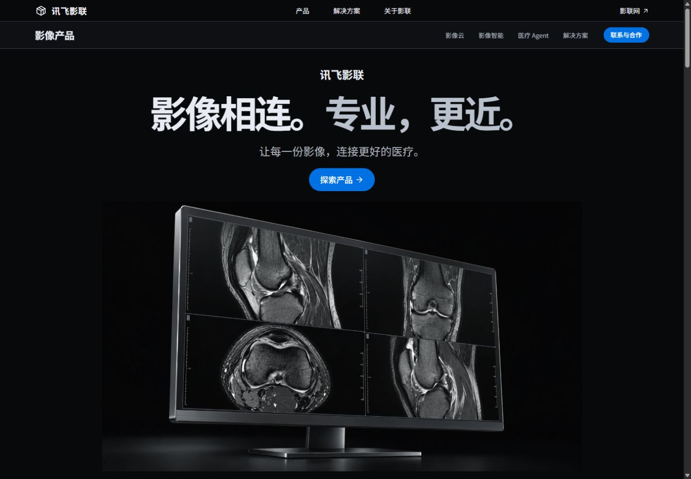

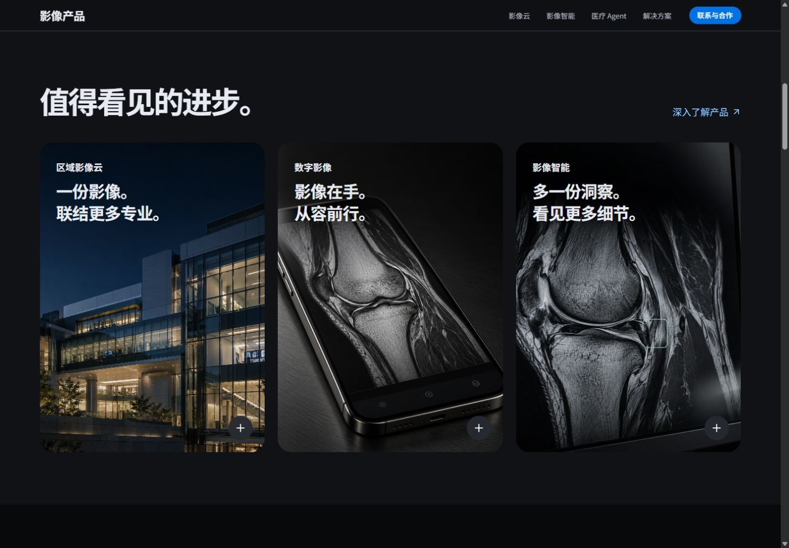

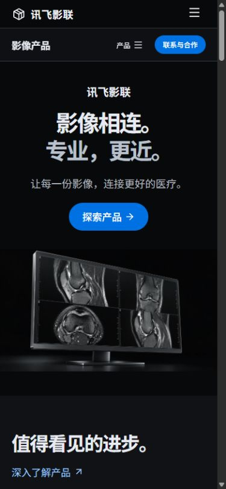

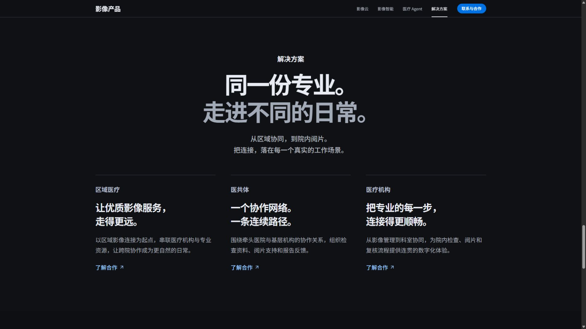

## 前版黑色工作台记录

日期：2026-10-10。对象：黑色与石墨灰视觉、可操作首屏与新协作照片。

- npm test：7 项原有生命周期测试通过；TypeScript 严格检查和生产构建通过。
- 最终入口 JS 271.14 KB / gzip 83.12 KB，CSS 61.79 KB / gzip 12.42 KB，共用 UI 140.53 KB / gzip 47.71 KB；没有新增依赖。
- 生产预览：桌面 1440 × 1000，手机 390 × 844，均没有文档横向溢出。
- 首屏三个预览可点击切换；ArrowRight、Home 与 End 更新选择和焦点。切换后影像帧保留。
- 首屏翻帧更新可访问图片标签；手机到第六帧后下一帧禁用，返回第一帧后上一帧禁用。减少动态模式下 CSS animationName 为 none。
- 页面各章节均为黑色或石墨灰。产品详情同样为深色，手机弹窗没有横向溢出。
- 桌面报告草稿可编辑保存；医共体选项更新说明，新照片加载成功。首页只有一处照片 img，不复用旧终端或医生图片。
- 手机首屏可切换报告空间和协作路径；Escape 关闭详情后焦点回到探索云影像入口。
- 没有重复 HTML id，生产预览 error 日志为空。
- 当前媒体仅两份 WebP，总计 496,964 字节；旧照片只留在 docs 归档，不进入 dist。

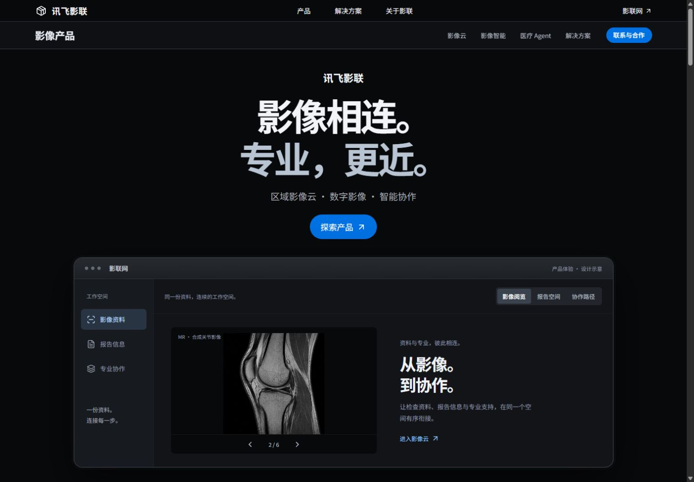

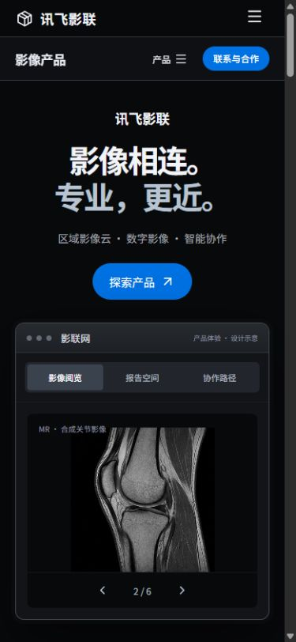

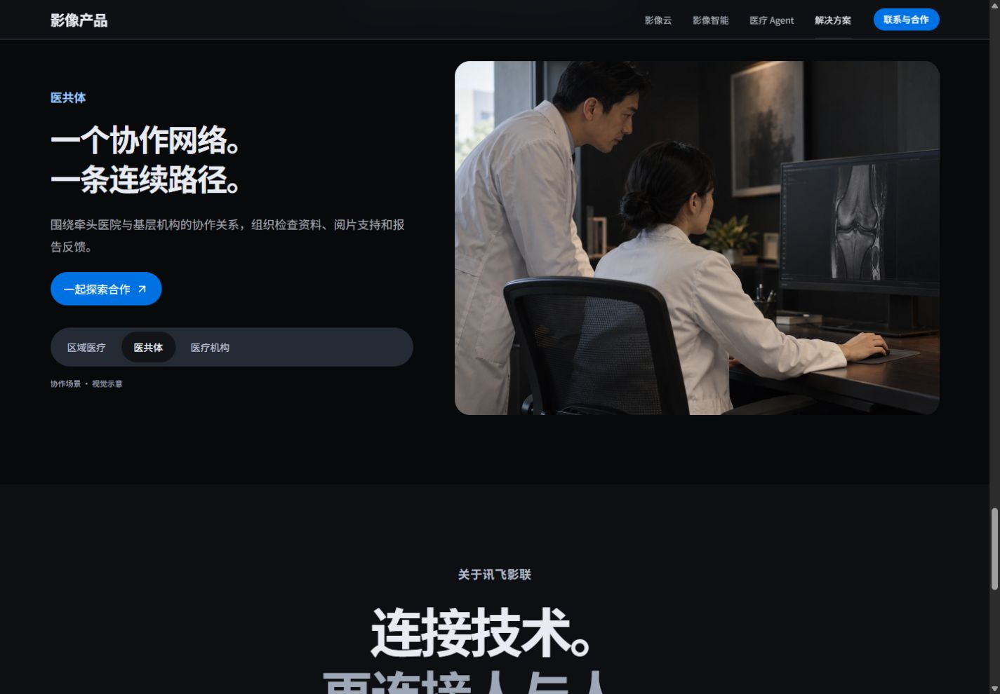

## 浅色前版记录

日期：2026-10-10。对象：统一浅色视觉、去除重复照片，以及保留的产品交互。

## 自动检查

- npm test：7 个协作流程生命周期测试通过。
- npm run build：TypeScript 严格检查与 Vite 生产构建通过。
- 首页入口 JS 266.61 KB / gzip 82.46 KB，共用 UI 分包 140.57 KB / gzip 47.73 KB。
- CSS 56.02 KB / gzip 12.08 KB；移除旧深色首屏、图片亮点和医生照片覆盖层样式。
- 未新增依赖。新浅色主视觉替换旧深色图，旧图归档到 docs，不进入部署；当前三个 WebP 共 528,078 字节。六帧阅片仍共享一个图集。

## 浏览器检查

使用本地生产预览 4173 与开发页面进行实际点击。桌面 1280 × 720、1920 × 1080，手机 390 × 844。

本次检查：

- 导航、首屏、云影像、影像智能、解决方案与详情采用浅色外框。深色仅保留在实际影像显示区域。
- 首页只有两处 img：首屏浅色终端与解决方案医生照片，各出现一次，加载成功。
- 四张亮点使用不同的代码图形，不引用这两张照片；桌面左右构图，手机上下构图。首张从统一边距开始，下一项可推进至第四张并禁用。
- 1920 × 1080 首屏主图完整位于可视区域；上述三种尺寸没有文档横向溢出。
- 桌面报告编辑与保存正常，联动对比到第 3 / 第 6 帧；医共体选项更新说明。
- 手机远程会诊显示两种协作角色图形，编辑并保存纪要后显示本页保留状态，返回会诊恢复角色界面。
- 本地生产预览的 error 日志为空。

前版六种场景已验证的交互，当前实现保留：

- 六个选项分别显示区域连接、手机影像、远程会诊、六帧质控、报告编辑、双视图对照；手机六种场景均无文档横向溢出。
- 区域网络节点选择与机构侧栏、连接说明保持同步。
- 手机影像可切换到报告；分享范围取消勾选报告后，确认显示仅选择影像；不进行真实传输。
- 会诊可暂停与恢复影像展示；会诊纪要为受控输入，保存后显示本页保留状态；不申请麦克风或视频权限。
- 质控选择第 3 帧后可以标记与撤销复核；状态与帧标记一致。
- 报告可插入非诊断资料摘要、修改、保存；切换其他功能后草稿保留。
- 联动翻帧将两侧同时推进至第 3 / 第 6 帧，继续向前按钮禁用；独立模式只改变所选一侧。
- 放大显示 125%，复位恢复初始帧、100% 与联动状态；手机也能完成翻帧和缩放。
- 云影像与 AI 详情均可使用新的场景；首页与详情同时挂载时没有重复 HTML id。
- Escape 关闭详情，焦点恢复到入口；Tab 的 Home 键回到第一项。
- 亮点初始 scrollLeft 为 0；标题只有一处。
- 亮点按钮到第四项后禁用下一项，返回第一项后禁用上一项；滚动位置计算使用实际卡片偏移，不硬编码卡片宽度。
- 键盘右方向键将亮点推进到数字影像；生产预览来源的 error 日志为空。
- ?motion=off 下场景 animationName 为 none；没有固定扫描轨道。

上述交互是浏览器内的产品设计演示，不验证临床性能、实际会诊、AI 推理或平台账户能力。本页状态在刷新后清除，详情状态在关闭后清除。

## 本次截图

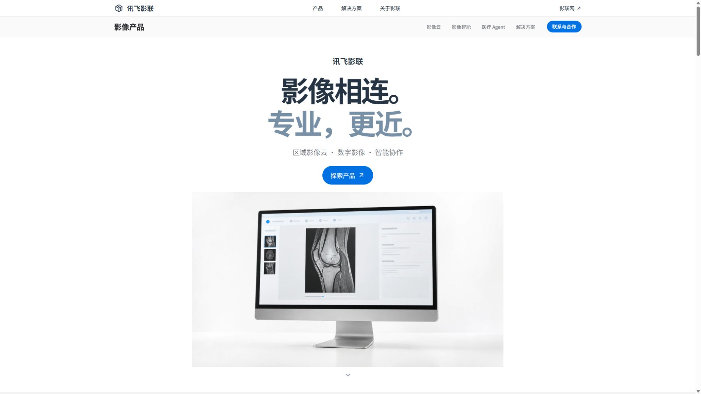

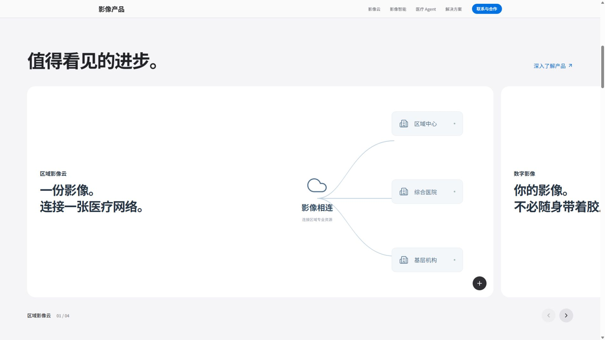

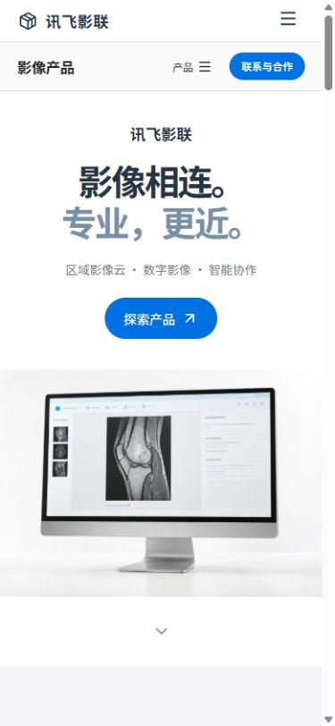

## 前版交互截图

历史图片保留在 docs/images，不进入部署输出。
