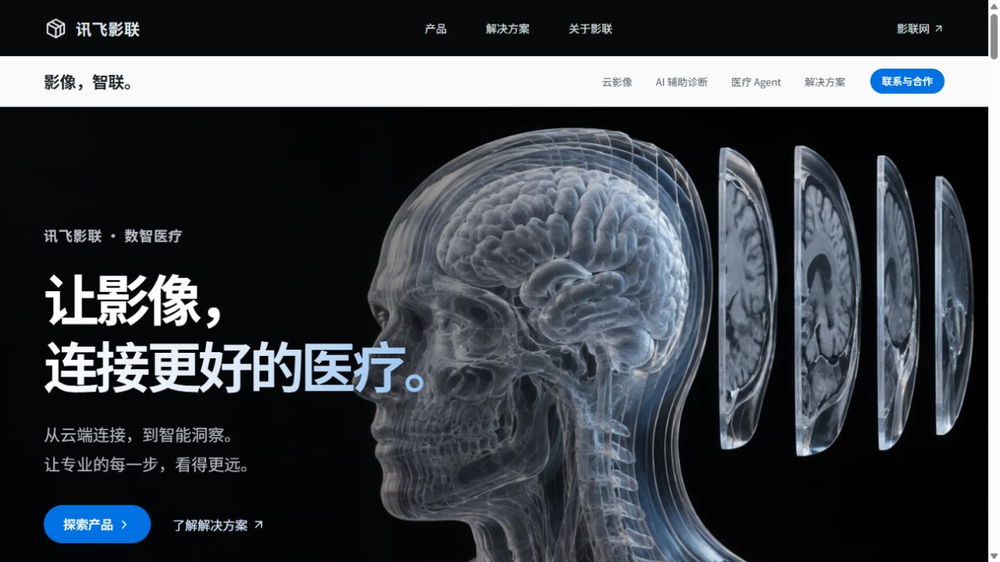
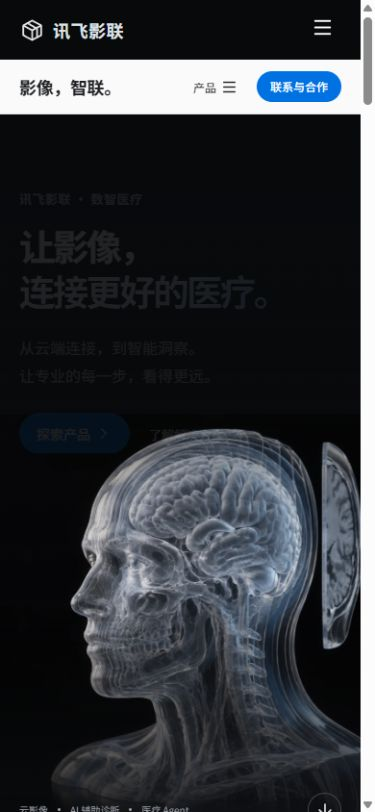

# 验证记录

日期：2026-10-09。对象：讯飞影联品牌官网设计概念。

## 自动检查

- `npm test`：7 个流程生命周期测试通过，覆盖四步推进、停止、场景取消、重启、过期事件和非法场景。
- `npm run build`：TypeScript 严格检查及 Vite 生产构建通过。
- 生产 JS 约 395 KB / gzip 126 KB；CSS 约 36 KB / gzip 9 KB。
- 两张 WebP 视觉素材合计约 267 KB；非首屏图片延迟加载，系统字体无需外部请求。
- `git diff --check` 通过。
- 新入口没有日志读取、API 请求、Token 工具或旧应用状态 Provider。

## 实际浏览器检查

通过 Codex 浏览器对开发版和本地生产预览版进行交互检查，不只是验证代码编译。

- 390 × 844：手机首屏、吸顶产品菜单、导航弹窗、单列云影像产品窗口；文档宽度未超过视口。
- 1280 × 720：桌面主视觉、双层导航、产品详情、云影像 Tab、AI 对照 range、Agent 流程。
- 1920 × 1080：大屏主标题 90 px，产品图与主标题比例正常，文档宽度未超过视口。
- 卡片轨道滚到末尾后，第三个位置指示生效，下一张按钮禁用。
- 云影像 Tab 点击和 ArrowRight 均能切换产品场景。
- 影像对照 range 使用 ArrowRight 后从 55% 更新为 56%。
- Agent 演示中切换场景会重置；重新启动可以完成演示。最后一步保留等待人工确认。
- 页脚“医共体”入口会使解决方案 Tab 选中医共体。
- 联系方式弹窗正常，复制按钮实际变为“已复制联系方式”；未发送邮件或拨打电话。
- 弹窗可用 Escape 关闭；焦点恢复使用 preventScroll，避免打断章节定位。
- 生产页读取到的 error/warn 日志为空。

截图：

未做真实临床分析、后端咨询提交或实际平台登录。当前是纯官网宣传及交互设计概念。

旧版截图仍保留在 docs/images 中作为项目历史材料；README 与本验证文档只引用新版截图，旧图不会进入 dist。
