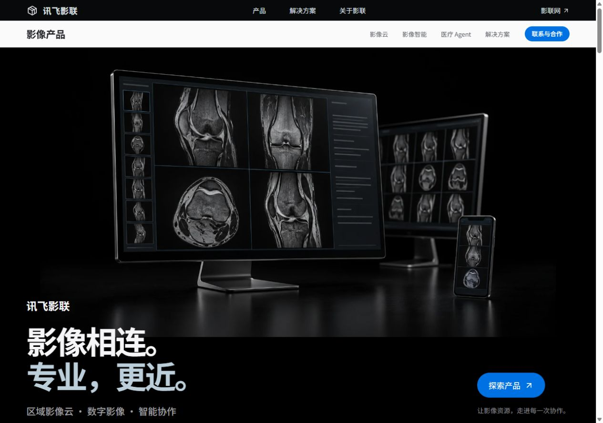
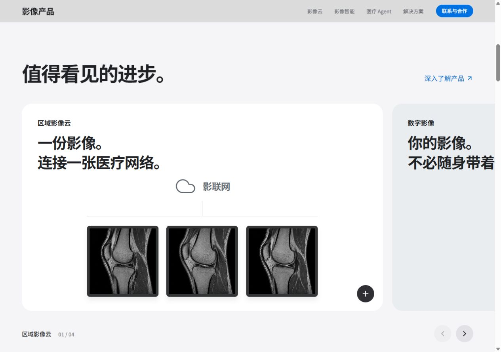
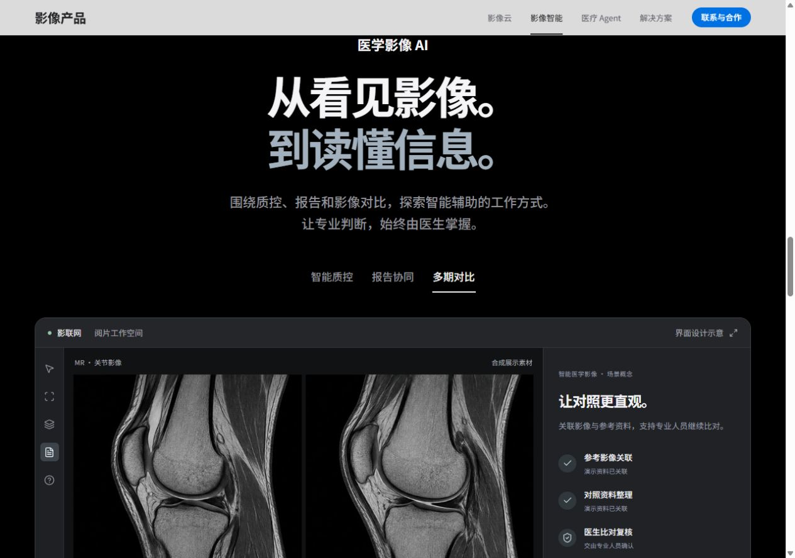
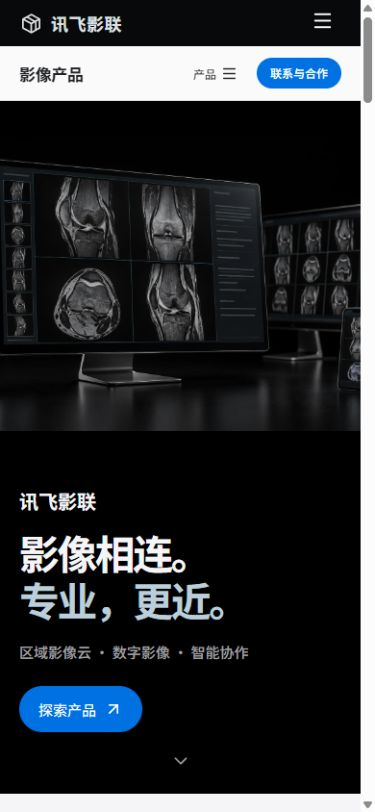

# 验证记录

日期：2026-10-09。对象：产品摄影、横向亮点与点击切换的官网版本。

## 自动检查

- npm test：7 个流程生命周期测试通过，覆盖推进、停止、场景取消、重新开始、过期事件和非法场景。
- npm run build：TypeScript 严格检查与 Vite 生产构建通过。
- 首页 JS 386.62 KB / gzip 122.91 KB；云影像、影像智能、医疗 Agent 按需分包分别约 1.52 / 1.23 / 5.19 KB。
- CSS 38.37 KB / gzip 8.78 KB；删除 108 条旧工作台和扫描界面无效样式。
- 当前发布三张 WebP 图片，合计 580,508 字节。六帧共享一个图集，不进行 Canvas 像素处理。
- 删除 ImagingStory.tsx 与 RadiologyFilm.tsx；首页不存在 story-track、story-pin 或 range 控件。
- 旧银灰主视觉移到 docs/reference-assets，不进入 dist/media。

## 浏览器检查

检查开发页面和本地生产预览（4173 端口）。

- 1280 × 900：首屏和章节排版正常，没有文档横向溢出；主视觉实际加载尺寸 1672 × 941。
- 390 × 844：生产首屏图片正常，菜单可打开并选择章节；手机工作台纵向排列，无文档横向溢出。
- 横向亮点左右按钮可以到达第四项，第四项禁用下一项；手机方向键切换到数字影像，状态说明同步更新。
- 首页 AI 点击多期对比，立即呈现对照视图、当前视图及相应复核说明；Home 键回到智能质控并恢复正确 Tab 焦点。
- 云影像首页选择远程会诊，工作台说明、章节描述与协作节点联动；详情数字影像 Tab 正确显示移动胶片界面。
- AI 详情选择报告协同显示报告框架；Escape 关闭后焦点恢复到了解智能影像按钮。
- 生产版 Agent 演示最终显示资料已整理、等待人工确认；场景切换恢复准备状态。流程仅为本地交互演示。
- 医疗解决方案切换至医共体后，方案文字同步更新。
- 生产页读取的 error 日志为空。
- 系统减少动态效果和 ?motion=off 共用正常文档布局，减少动态时没有额外的固定场景。

## 生产版截图

医学影像为合成设计素材，AI 与 Agent 为界面和流程概念。不测试临床性能、平台账户登录或咨询提交；本站不提供这些能力。历史版本截图保留在 docs/images，不进入部署输出。
