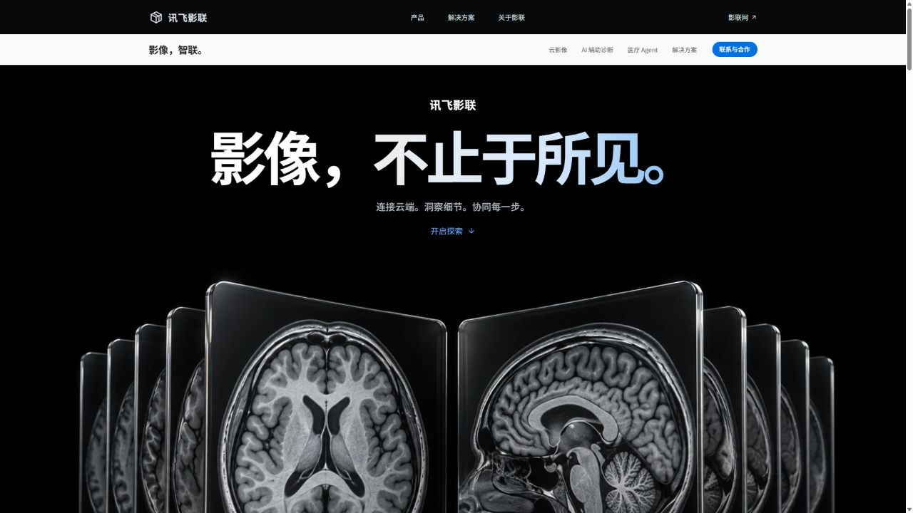
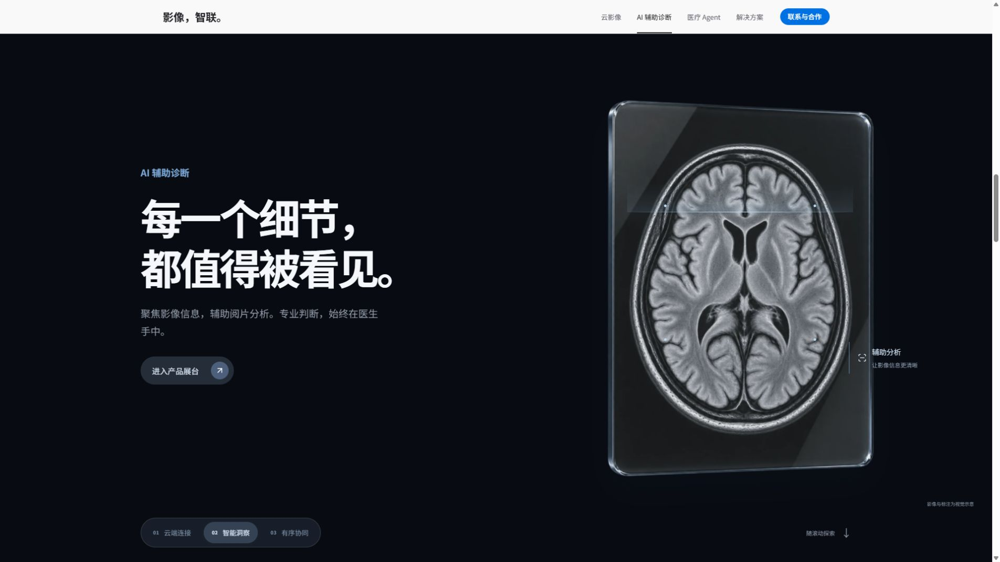

# 验证记录

日期：2026-10-09。对象：讯飞影联品牌官网设计概念。

## 自动检查

- `npm test`：7 个流程生命周期测试通过，覆盖四步推进、停止、场景取消、重启、过期事件和非法场景。
- `npm run build`：TypeScript 严格检查及 Vite 生产构建通过。
- 首页生产 JS 约 387 KB / gzip 124 KB；三个按需展台 JS 分别约 3.5 / 3.9 / 5.2 KB；CSS 约 42 KB / gzip 10 KB。
- 四张 WebP 合计约 577 KB。首屏主视觉约 134 KB、优先加载；其他图片延迟加载，系统字体无需外部请求。
- `git diff --check` 通过。
- 新入口没有日志读取、API 请求、Token 工具或旧应用状态 Provider。

## 实际浏览器检查

通过 Codex 浏览器对开发版和本地生产预览版进行交互检查，不只是验证代码编译。

- 390 × 844：手机云端与 Agent 滚动场景、吸顶菜单、导航弹窗正常；文档宽度未超过视口。
- 375 × 667：小高度手机的云端场景重新调整切片大小，章节按钮保留在视口内。
- 1280 × 720：桌面首屏、云端/AI/Agent 三阶段定位与产品入口正常。
- 1920 × 1080：主视觉、近看场景与全幅协作照片正常，文档宽度未超过视口。
- AI 章节定位后，吸顶导航同步选中 AI；场景中始终只有一个标题节点，无前一阶段文字残留。
- 开发与生产版本都能按需打开 AI 展台；range 按 ArrowRight 从 55% 更新为 56%。
- Agent 展台选择临床协作并运行，最终状态为演示完成、等待人工复核。
- 页脚“医共体”入口同步切换方案 Tab。
- 展台 Escape 关闭后，焦点恢复至原“进入产品展台”按钮。
- `?motion=off` 实际渲染三个静态 article、没有 sticky 场景；AI 展台仍可打开和操作。
- 读取的浏览器日志没有生产页错误；开发页切换减少动态效果模式产生 Motion 的预期提示。

云影像 Tab、联系方式复制、Agent 切换取消等原有行为在上一版已有浏览器验证。本次保留实现，并用流程测试检查取消与过期事件，不重复发送邮件或拨打电话。

截图：

未做真实临床分析、后端咨询提交或实际平台登录。当前是纯官网宣传及交互设计概念。

旧版截图仍保留在 docs/images 中作为项目历史材料；README 与本验证文档只引用新版截图，旧图不会进入 dist。
